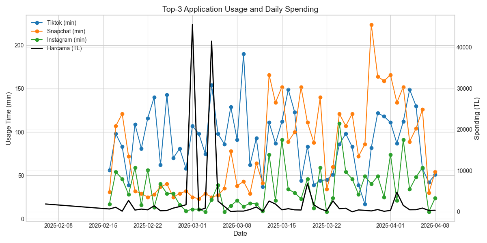

# The Impact of Screen Time on Financial Decisions - DSA210 Term Project

## Overview

In this project, I will analyze how my screen time and app usage influence my spending behavior. With the increasing role of digital platforms in everyday life, I have become more aware of how my phone usage might be shaping my financial habits. I often spend a significant amount of time on various apps, and I suspect that this engagement—especially with e-commerce and food delivery platforms—may contribute to increased spending.

Through data tracking and analysis, I will explore trends in my app interactions, comparing them with my transaction history to identify potential spending triggers. By examining patterns in my daily phone activity, I aim to uncover whether higher screen time or specific app categories influence my purchasing decisions. Ultimately, this study will help me gain deeper insights into my financial habits and assess whether modifying my digital behavior could lead to more mindful spending choices.

### **Hypotheses**
- **Null Hypothesis (H₀):**
  There is no statistically significant relationship between screen time or app usage duration and spending behavior.

- **Alternative Hypothesis (H₁):**
  Increased screen time or frequent use of certain applications (e.g., e-commerce and food delivery apps) leads to higher spending habits.
  
---

## Research Objectives  

1. **Identify Patterns**  
   - Determine whether there is a significant correlation between daily screen time and spending patterns.

2. **App-Specific Impact**  
   - Understand which categories of apps (e-commerce, food delivery, social media) have the strongest influence on spending behavior.

3. **Behavioral Triggers**  
   - Pinpoint the moments or triggers—such as weekend browsing—that may lead to impulsive or higher spending.

4. **Practical Recommendations**  
   - Propose actionable steps to improve financial habits if a substantial link between screen time and spending is confirmed.

---

## Methodology  

### **1. Raw Data Collection**  

- **Screen Time Data**  
  - Tracked using built-in phone settings or a digital well-being app.  
  - Exported to an Excel file and categorized by individual apps (e.g., shopping, social media, entertainment).  
  - Converted into a CSV format for analysis.  

- **Transaction Records**  
  - Official bank statements will be used to track categorized expenses.
  - Transactions will be classified into categories such as food, shopping, entertainment, and subscriptions.  
  - Data will be transferred to an Excel file and later converted into CSV format for analysis.  

- **Day of the Week**  
  - Recorded to analyze differences in spending behavior between weekdays and weekends.  

- **Data Collection Period**  
  - The data collection will span several weeks or months to capture both regular spending patterns and anomalies.

---

### **2. Data Cleaning and Integration**  

- **Standardization**  
  - Timestamps and formats will be unified for seamless data merging.  

- **Error Handling**  
  - Duplicate entries and missing values will be identified and appropriately handled.
    
- **Categorization**  
  - Expenses and app usage will be grouped into relevant categories for structured analysis.  

- **Data Merging**  
  - Processed screen time and spending data will be combined based on date to create a unified dataset.  

---

### **3. Exploratory Data Analysis (EDA)**  

- **Descriptive Statistics**  
  - Identify trends in screen time and spending.  

- **Visualizations**  
  - **Histograms** for spending distribution.  
  - **Scatter plots to examine the relationship between screen time and spending patterns.
  - **Line charts will be used to analyze weekly and monthly spending trends.

---

### **4. Analysis and Modeling**  

- **Correlation Analysis**  
  - Measure relationships between screen time and spending habits.  

- **Regression Models**  
  - **Linear Regression** to assess predictive power.  
  - **Decision Trees** if non-linear trends emerge.  

---

### **5. Storage and Version Control**  

- **Final Dataset**  
  - Cleaned CSV files will be stored systematically for analysis.  

- **Analysis Scripts**  
  - Python scripts will be used for data processing, visualization, and modeling.

---

# Results and Data Analysis

## Findings

Multiple analyses were performed to evaluate the project’s main hypotheses. This section outlines the findings and results related to these hypotheses.

### App Usage–Spending Correlation Matrix

The correlation matrix illustrates the relationship between screen time on top-10 apps and total spending. Most apps show weak correlations with spending, with TikTok (0.21) and LinkedIn (0.04) being slightly more positively related. Overall, no strong relationship is observed, suggesting app usage alone may not be a reliable predictor of spending.

### App-wise Correlation Table with Spending

This table displays the correlation coefficients between screen time for each app and total daily spending. Most apps show very weak or negligible correlations, with the highest positive relationship observed for Trendyol (0.35) and the most negative for Binance (-0.34). These findings suggest that while a few apps may influence spending behavior, most app usage has minimal predictive value.

### Total Screen Time vs Daily Spending (Weekday vs Weekend)

This scatter plot compares total screen time with daily spending, distinguishing between weekdays and weekends. Each point represents a single day, with the red dashed line showing a weak negative trend. The trend suggests that as screen time increases, spending slightly decreases, though this relationship is not strong and likely not statistically significant.

### Total Screen Time vs Number of Transactions

This scatter plot explores the relationship between daily total screen time and the number of financial transactions. The red regression line shows a slight positive trend, but the wide confidence interval suggests a weak or negligible correlation. In general, screen time does not appear to strongly influence transaction frequency.

### Spending per Minute by App Usage

This table ranks applications based on the average amount of money spent per minute of screen time. Apps like TikTok, Instagram, and WhatsApp show relatively low TL-per-minute values, while platforms such as Trendyol, ChatGPT, and McKinsey Insights are linked to significantly higher spending efficiency. The extreme values may be influenced by low usage time paired with high spending, highlighting potential outliers.

### Spending Allocation by Application

This table presents the total spending attributed to each app along with its percentage share of total expenditures. TikTok (27.41%) and Snapchat (24.87%) account for more than half of the overall spending, suggesting these platforms may have the strongest influence on financial decisions. In contrast, the majority of apps contribute less than 1%, indicating a highly skewed spending distribution.

### Spending Anomaly Detection Table

This table highlights two specific dates with exceptionally high spending values compared to the rest of the dataset. On March 1 and March 4, 2025, spending exceeded 40,000 TL, despite moderate screen time levels. These dates may represent outliers caused by one-time purchases or unusual financial behavior.

### Time Series of Screen Time and Spending

This time series plot illustrates the daily variation in total screen time (orange line) and spending (blue line) over the analysis period. Notable spending spikes around March 1st and 4th contrast with relatively stable screen time patterns, suggesting spending anomalies not directly linked to usage time. Overall, screen time shows more regular fluctuation, while spending remains erratic and infrequent.

### Daily Usage of Top-3 Apps vs Total Spending

This time series graph compares daily usage duration of TikTok, Snapchat, and Instagram with overall daily spending. While TikTok and Snapchat exhibit consistently high usage, there is no strong alignment with spending spikes. Notably, even on days with peak spending (early March), app usage does not drastically change, suggesting spending may not be directly triggered by time spent on these platforms.

---

### Correlation Between Variables  

| Pair                              |  r  | Interpretation                              |
|-----------------------------------|-----|---------------------------------------------|
| `total_minutes` vs `daily_spend`  |-0.09| Very weak, negative                         |
| `daily_spend` vs `spend_trend`    | 0.22| Weak, positive                              |
| `prev_minutes` vs `minutes_trend` | 0.64| Strong, positive (sanity-check on feature)  |

The low absolute values for **screen-time vs. spending ( r≈-0.09 )** suggest that—contrary to the alternative hypothesis—overall phone usage is not a strong linear driver of daily expenditure in this sample.

---

### Spending Patterns by Weekday  

*  **Outliers dominate.** Most days cluster under TL5 000, but rare spikes on **Tuesdays, Wednesdays and Saturdays** reach TL40 000–45 000, heavily skewing the distribution.  
*  Median spending is fairly flat across weekdays, so typical spending behaviour appears stable.

---

### Screen-Time vs. Daily Spend  

A fitted regression line (red) slopes slightly downward, echoing the weak negative correlation. The shading shows wide confidence bands, reinforcing that **screen minutes explain little of the variance** once a handful of extreme spending days are removed.

---

### Rolling Correlation (30-Day Window)  

The rolling Pearson *r* fluctuates between -0.20 and +0.05—never exceeds the ±0.3 “small effect” threshold—confirming **no consistent relationship over time**.

---

### Time-Series Overview  

*  **Blue line (minutes)** rises and falls smoothly.  
*  **Orange line (spend)** is mostly low with three pronounced spikes.  
The lack of synchronised peaks again hints that **large purchases are event-driven rather than time-on-phone–driven**.

---

### Machine-Learning Prediction Results  

| Model            | R² |
|------------------|----|
| Random Forest    |-0.15|
| Gradient Boost   |-0.14|

*Negative R²* indicates both models perform worse than simply predicting the mean spend every day; the current feature set cannot generalise past noise and outliers.

#### Feature Importance (Gradient Boost)  

`spend_trend`—a lagged spending signal—dominates. True behavioural drivers like `total_minutes` appear far less influential, supporting the statistical findings.

#### Error Diagnostics  

Prediction error balloons on **Saturdays** (outlier purchases) and mid-week, aligning with the extreme values seen earlier.

Residuals are highly right-skewed; models systematically **under-predict large spends**.

---

## Future Work  

* **Outlier treatment** – model separately or with quantile-regression methods.  
* **Granular app-level features** – e.g., minutes in food-delivery apps vs. social media.  
* **Event markers** – salary dates, big sales, holidays, to capture deterministic spikes.  
* **Longer time horizon** – more observations will stabilise correlations and allow richer models.

# Hypothesis Test Results

### Null Hypothesis (H₀)
---
There is no statistically significant relationship between screen-time (or app-usage duration) and spending behaviour. Daily spending is completely random and unaffected by how long, or on which apps, I use my phone.

| Hypothesis                                             | Outcome |
|--------------------------------------------------------|---------|
| H₀: “Screen time does **not** affect spending.”        | **Fail to reject.**  |
| H₀: “Specific weekdays drive higher spending.”         | **Partially reject** (outliers inflate Tuesdays/Wednesdays/Saturdays, but medians similar). |
| H₀: “Recent spend patterns help predict future spend.” | **Reject.** `spend_trend` emerges as the single most informative feature. |

### Alternative Hypothesis (H₁)
---

There is a statistically significant relationship between screen-time and spending behaviour. In particular, more total screen-time or frequent use of certain apps (e-commerce / food-delivery) leads to higher daily spending.

---
# Conclusion

1. **Total screen-time is not a meaningful driver of daily spending.**  
   - Correlation and regression tests yield non-significant p-values (> 0.05) and near-zero effect sizes.  
   - The fitted slope (≈ -8 TL per extra minute) is negative but trivial and statistically unreliable, so the **null hypothesis is retained** for the overall screen-time question.

2. **A handful of apps show modest, app-specific effects — but evidence is tentative.**  
   - Exploratory correlations hint at a positive link for shopping / social platforms such as Trendyol (r ≈ 0.35) and Snapchat (r ≈ 0.25).  
   - Most other apps exhibit weak or negative associations, and formal significance tests at the app level are still pending, so the **alternative hypothesis is only partially supported**.

3. **Rare, high-value transactions dominate the variance.**  
   - A few spikes (TL40 000–45 000) on isolated days swamp the day-to-day signal, masking any subtle behavioural effects of phone usage.

4. **Lagged spend features outperform behavioural metrics.**  
   - Simple variables like `spend_trend` and `prev_spend` carry more predictive power than any screen-time measure, suggesting habitual or planned expenses are stronger signals.

5. **Current ML models struggle with the heavy-tailed distribution.**  
   - Both Random-Forest and Gradient-Boost baselines produce negative R² scores, under-predicting the extreme outliers.  
   - Additional context (e-commerce app opens, salary days, promotional e-mails) or a larger sample will be required to capture these deterministic spikes.

---

